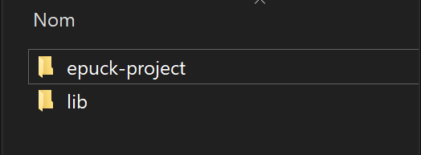
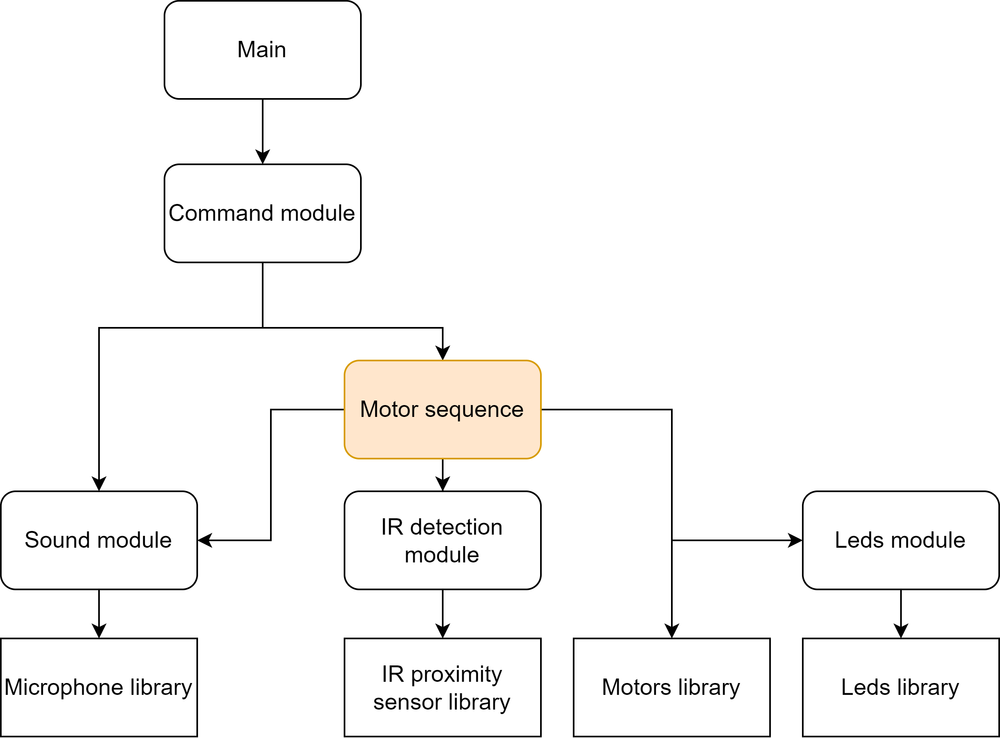

# epuck-project
This repository is used for a mini-project using the e-puck2 robot at EPFL.
Coded by David Junqueira and Antonin Mignot

In order to run the project, put the lib file at the same level as "epuck-project-main" and import the project in eclipse 

